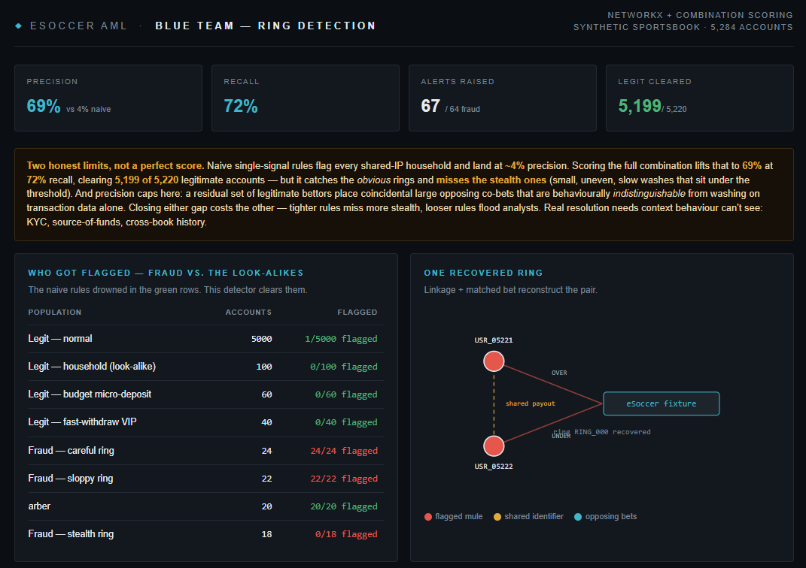

# eSoccer AML Engine: Red Team / Blue Team

An end-to-end Anti-Money Laundering detection project for the **iGaming /
sportsbook** sector, built around virtual **eSoccer** markets (the 6–12 minute
simulated-football matches that fire constantly on Bet365, William Hill, et al.).
It has two halves:

- a **Red Team** that builds a realistic sportsbook full of chaotic legitimate
  bettors and injects coordinated matched-betting laundering rings, and
- a **Blue Team** that hunts those rings with a graph + behavioral-scoring engine
  and is scored honestly against ground-truth labels.


*(Open `blue_team_dashboard.html` to see the live report, or drop a screenshot at the path above.)*

---

## Why two teams

To build a detector you can trust, you have to build an adversary worth beating.
A simulator that injects *"two accounts, same IP, opposing bets"* and a detector
that flags *"two accounts, same IP, opposing bets"* is a **mirror**, not a model,
 it scores ~100% and proves nothing. So the Red Team is built to make detection
**hard**, and the Blue Team is judged on whether it still separates fraud from
the look-alikes.

## The finding (two honest limits, not a perfect score)

| Approach | Precision | Recall |
|----------|-----------|--------|
| Naive "shares an IP" | ~4% | ~34% |
| Naive "opposing bets + shared IP" | ~6% | - |
| **Combination scoring (this engine)** | **~69%** | **~72%** |

Single signals collapse to ~4–6% precision because innocent households and CGNAT
users trip them constantly. Scoring the **combination** fixes that, but it
doesn't pretend to be perfect:

- **Recall gap**  it catches the obvious sloppy and careful rings but **misses
  the stealth rings** (small, uneven, slow washes that stay under the threshold).
- **Precision cap (~70%)**  a residual set of legitimate bettors place
  *coincidental* large opposing co-bets that are behaviourally indistinguishable
  from washing on transaction data alone.

Closing either gap costs the other (tighter rules miss more stealth; looser rules
flood analysts). Real resolution needs context behaviour can't see: KYC,
source-of-funds, cross-book history. That tradeoff *is* the deliverable.

## Red Team: `generate_esoccer_data.py`

Builds a synthetic eSoccer sportsbook and labels every account:

- **Environment** virtual fixtures (GT Leagues, eAdriatic, H2H GG, Battle
  Volta) with 2-way Over/Under markets carrying a ~5% house edge (*the vig* the
  fee a launderer accepts to wash funds).
- **Haystack** legitimate bettors via a **log-normal** deposit distribution;
  chaotic, multi-bet, long-term negative EV.
- **Look-alike confounders** (the hard part): CGNAT/household IP sharing, legit
  opposing-bet households, fast-withdrawing VIPs, budget micro-depositors.
- **Rings** matched-betting laundering at three tradecraft levels: *sloppy*
  (shares IP/device/payout, fires in minutes), *careful* (distinct IPs, staggered),
  and *stealth* (shares nothing, small uneven stakes, slow).

Outputs `users.csv`, `transactions.csv`, `bets.csv`, `fixtures.csv` and prints
a report showing naive single-signal rules drowning at ~5% precision.

## Blue Team: `detect_esoccer_aml.py`

Hunts the rings without ever seeing the label:

- **Identity-linkage graph** (`networkx`) connects accounts sharing IP / device
  / payout wallet; connected components recover the full ring from any one hit.
- **Combination scoring** weighs identity linkage + bet symmetry (opposing,
  same fixture) + stake magnitude + stake equality + timing + the
  deposit→bet→**sweep** pattern into an interpretable risk score.
- **Honest evaluation** precision / recall / F1 vs. ground truth, a threshold
  sweep, recall broken out by ring tradecraft, and a "who got flagged" table that
  shows the legit look-alikes being correctly cleared.

## Skills demonstrated

Adversarial **synthetic data design** (the confounders are the point) · statistical
modelling (`numpy` log-normal) · **graph / network analysis** (`networkx`) ·
feature engineering · imbalanced-class evaluation done honestly (precision /
recall, never accuracy) · iGaming AML typologies (matched betting, structuring,
stashing) · reasoning about detection limits · clear technical writing.

## Quickstart

```bash
pip install pandas numpy networkx

# 1) Red Team: generate the labelled sportsbook
python3 generate_esoccer_data.py --users 5000 --rings 32 --output-dir ./data

# 2) Blue Team: hunt the rings and build the report
python3 detect_esoccer_aml.py --data ./data -o blue_team_dashboard.html
```

| Script | Key flags |
|--------|-----------|
| `generate_esoccer_data.py` | `--users`, `--rings`, `--output-dir`, `--seed` |
| `detect_esoccer_aml.py` | `--data`, `-o/--output` |

## Privacy

**100% synthetic.** Every user ID, IP, device, payout wallet, and timestamp is
programmatically generated, no real PII, no proprietary sportsbook data, so the
dataset is safe for public version control and AML training.

## Roadmap

- **Typology B: minimal-play stashing:** deposit large, place one micro-bet on a
  ~1.01 favourite, withdraw the lot. (Look-alike already seeded: fast-withdraw VIPs.)
- **Typology C: smurfing / structuring:** networks of micro-deposits just under
  KYC thresholds. (Look-alike already seeded: budget micro-depositors.)
- Behavioural fingerprinting and time-windowed velocity to push past the
  identity-linkage ceiling.

## Author

**César B. Miranda** - Fraud / Trust & Safety / Risk operations, automated with
Python + SQL. · [LinkedIn](https://www.linkedin.com/in/cbadilla/) ·
[github.com/xrbmai-cmd](https://github.com/xrbmai-cmd)
