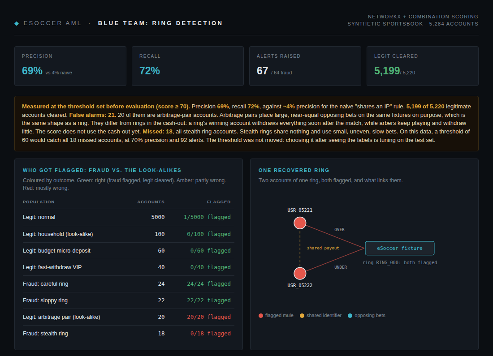

# eSoccer AML Engine: Red Team / Blue Team

An end-to-end anti-money laundering detection project for the **iGaming /
sportsbook** sector, built around virtual **eSoccer** markets (the 6 to 12 minute
simulated football matches that run all day on Bet365, William Hill and others).
It has two halves:

- a **Red Team** that builds a realistic sportsbook full of chaotic legitimate
  bettors and injects coordinated matched-betting laundering rings, and
- a **Blue Team** that hunts those rings with a graph and behavioural scoring
  engine, and is scored honestly against the ground-truth labels.


*(Open `blue_team_dashboard.html` for the full report.)*

---

## Why two teams

To build a detector you can trust, you have to build an adversary worth beating.
A simulator that injects *"two accounts, same IP, opposing bets"* and a detector
that flags *"two accounts, same IP, opposing bets"* is a **mirror**, not a model:
it scores about 100% and proves nothing. So the Red Team is built to make
detection **hard**, and the Blue Team is judged on whether it still separates
fraud from the look-alikes.

## The finding

| Approach | Precision | Recall |
|----------|-----------|--------|
| Naive "shares an IP" | ~4% | ~34% |
| Naive "opposing bets + shared IP" | ~5% | ~34% |
| **Combination scoring (this engine), score 70 or more** | **~69%** | **~72%** |

Single signals collapse to about 4 to 5% precision because innocent households
and CGNAT users trip them all the time. Scoring the **combination** fixes that.
The threshold (70) was fixed before evaluation, and the result has two clear
limits:

- **False alarms: 21, and 20 of them are legit arbitrage pairs.** Arbers place
  large, near-equal opposing bets on the same fixtures **on purpose**, which is
  the same shape as a ring. They differ from a ring in one place, the cash-out:
  a ring's winning account withdraws everything soon after the match, while
  arbers keep playing and withdraw little. The score does not use the cash-out
  yet, so every arber is flagged. This sets the precision cap. (In a real
  sportsbook these alerts are not wasted: arbitrage bettors are a trading team
  matter.)
- **Missed: all 18 stealth ring accounts.** Stealth rings share nothing and use
  small, uneven, slow bets. On this data they score 60 to 65, just under the
  threshold.

The threshold sweep shows that 60 would have caught every stealth account here
at about the same precision. The threshold was **not** moved, because choosing
it after seeing the labels is tuning on the test set. Instead, the unchanged
detector was run on five fresh data sets (the first five seeds tried):

| Seed | Precision at 70 | Recall at 70 | Precision at 60 | Recall at 60 |
|------|-----------------|--------------|-----------------|--------------|
| 7 (original) | 69% | 72% | 70% | 100% |
| 11 | 68% | 69% | 67% | 94% |
| 23 | 71% | 75% | 70% | 97% |
| 42 | 68% | 78% | 64% | 92% |
| 101 | 65% | 72% | 60% | 92% |
| 2026 | 69% | 72% | 59% | 94% |

At 70 the result holds: 65 to 71% precision, 69 to 78% recall. At 60 recall
rises on every seed, but precision drops on most, because up to 19 normal
bettors cross that line. So the "free" stealth catch at 60 was partly luck of
the original seed. The arbers are flagged 20 out of 20 on every seed.

To reproduce a row:

```bash
python3 generate_esoccer_data.py --users 5000 --rings 32 --seed 11 --output-dir ./data_s11
python3 detect_esoccer_aml.py --data ./data_s11 -o dashboard_s11.html
```

## Red Team: `generate_esoccer_data.py`

Builds a synthetic eSoccer sportsbook and labels every account:

- **Environment:** virtual fixtures (GT Leagues, eAdriatic, H2H GG, Battle
  Volta) with 2-way Over/Under markets carrying a ~5% house edge (the vig, the
  fee a launderer accepts to wash funds).
- **Haystack:** legitimate bettors with a **log-normal** deposit distribution;
  chaotic, many bets, long-term negative EV.
- **Look-alike confounders** (the hard part): CGNAT and household IP sharing,
  legit opposing-bet households, fast-withdrawing VIPs, budget micro-depositors,
  and **arbitrage pairs**, the hardest one.
- **Rings:** matched-betting laundering at three levels of tradecraft: *sloppy*
  (shares IP, device and payout, fires in minutes), *careful* (distinct IPs,
  staggered, sometimes a shared payout) and *stealth* (shares nothing, small
  uneven stakes, slow).

Outputs `users.csv`, `transactions.csv`, `bets.csv`, `fixtures.csv` and prints
a report showing the naive single-signal rules at about 5% precision.

## Blue Team: `detect_esoccer_aml.py`

Hunts the rings without ever seeing the label. Each account gets points for:

- **Identity linkage** (`networkx`): shares an IP, device or payout wallet with
  another account. The cluster size is shown in the alert table, so an analyst
  can pull the rest of a linked cluster.
- **Matched co-bet:** a large bet on the opposite side of the same fixture as
  another account, scored up by stake size, how near-equal the two stakes are,
  and how close together they were placed.
- **One large bet:** at most two bets in total, one of them large.
- **New account:** registered in the last 7 days.

**Not scored yet:** the cash-out. Deposits and withdrawals are computed, but no
rule uses them. That is the next change (see Roadmap).

**Evaluation:** precision, recall and F1 against the ground-truth labels, a
threshold sweep, recall broken out by ring tradecraft, and a table showing which
populations got flagged, coloured by whether the detector got each one right.
The summary text on the dashboard is calculated from each run, not written by
hand.

## Skills demonstrated

Adversarial **synthetic data design** (the confounders are the point) ·
statistical modelling (`numpy` log-normal) · **graph / network analysis**
(`networkx`) · feature engineering · imbalanced-class evaluation done honestly
(precision and recall, never accuracy, threshold fixed before evaluation,
checked on fresh data) · iGaming AML typology: matched betting (stashing and
structuring are on the roadmap) · reasoning about detection limits · clear
technical writing.

## Quickstart

```bash
pip install pandas numpy networkx

# 1) Red Team: generate the labelled sportsbook
python3 generate_esoccer_data.py --users 5000 --rings 32 --output-dir ./data

# 2) Blue Team: hunt the rings and build the report
python3 detect_esoccer_aml.py --data ./data -o blue_team_dashboard.html
```

| Script | Key flags |
|--------|-----------|
| `generate_esoccer_data.py` | `--users`, `--rings`, `--output-dir`, `--seed` (default 7) |
| `detect_esoccer_aml.py` | `--data`, `-o/--output` |

## Privacy

**100% synthetic.** Every user ID, IP, device, payout wallet and timestamp is
generated by the script. No real PII and no proprietary sportsbook data, so the
dataset is safe for public version control and AML training.

## Roadmap

- **Score the cash-out.** Rings move the money out right after the match;
  arbers keep it in play. Any new rule gets evaluated on fresh seeds and
  reported next to the current numbers, not in place of them.
- **Typology B: minimal-play stashing:** deposit large, place one micro-bet on a
  ~1.01 favourite, withdraw the lot. (Look-alike already seeded: fast-withdraw
  VIPs.)
- **Typology C: smurfing / structuring:** networks of micro-deposits just under
  KYC thresholds. (Look-alike already seeded: budget micro-depositors.)
- Behavioural fingerprinting and time-windowed velocity to push past the
  identity-linkage ceiling.

## Author

**César B. Miranda**. Fraud, Trust & Safety and risk operations, automated with
Python and SQL. [LinkedIn](https://www.linkedin.com/in/cbadilla/) ·
[github.com/xrbmai-cmd](https://github.com/xrbmai-cmd)
